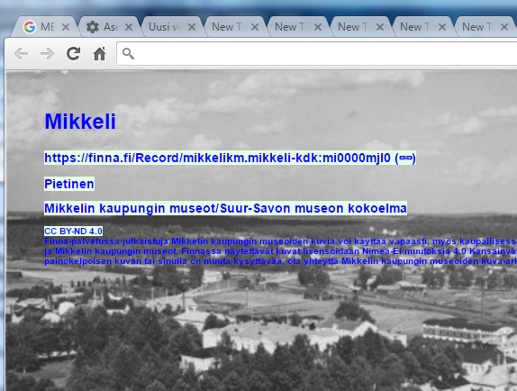
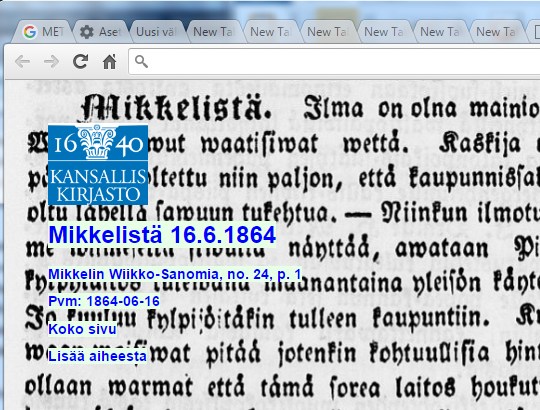

# Introduction

A way to show interesting historical news clippings and photos subtly whenever a new tab is opened in chrome
The empty tab space taken into useful use.

## Thanks and Acknowledgements

* Extension icon's drop cap M from, Ateneum journal of year 1900 http://digi.kansalliskirjasto.fi/aikakausi/binding/543454#?page=77
* Metropolitan Museum of Art for sharing their code.
* All the crowdsourcing participants, who have done clippings to Digi with 'Mikkeli' as place.

## TODO

* Lots of options to do things in more simpler way
* Localisation (html & tools)
